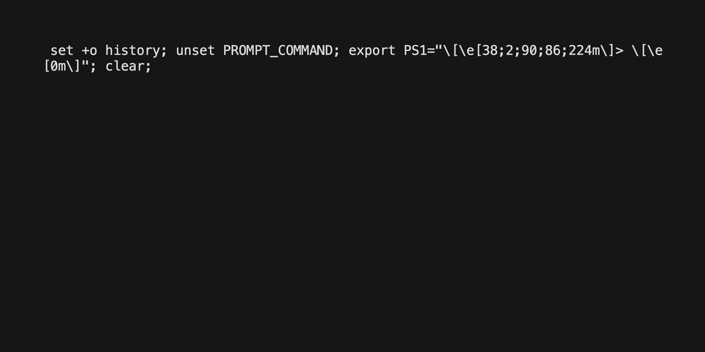

# terradoc

> Terraform provider docs in the terminal

## Overview

Searching through terraform provider docs on <https://registry.terraform.io> is
unpleasant.

I prefer consuming docs locally, similar to `go doc` and `cargo doc`.

Fortunately, the <https://registry.terraform.io> convention is to store docs in
`website/docs/` directory in the same repository as the provider source code.

This convenience utility script downloads the zipped repository locally and
extracts only the contents of `website/docs/*` so you can enjoy the
terminal/editor goodness that we all know and love, like:

- Using vim's built-in `:grep "<regex>"`, then navigate through results with
  `:cnext`, `:cprev`, `:copen`, or `:Cfilter <regex>`
  - Or with [fzf.vim](https://github.com/junegunn/fzf.vim) plugin for
    interactive fuzzy searching in vim: `:Files`, `:Rg`, `:Tags`
- Using [glow](https://github.com/charmbracelet/glow) markdown viewer CLI
- Using VS Code with [Go to Symbol](https://code.visualstudio.com/Docs/editor/editingevolved#_go-to-symbol)

### Demo



_Recorded using [vhs](https://github.com/charmbracelet/vhs)_

## Install

Clone or copy/paste the utility script somewhere in your `$PATH`, like `~/.local/bin/`.

You may need to install additional dependencies if they don't exist on your system:

- `curl`
- `unzip`

## Usage

`terradoc` accepts the following arguments in this order:

- author: `hashicorp` (default), or any registry.terraform.io namespace, or
  github organization.
- provider: `aws` (default), `google`, `azure`, ...etc. Any provider from
  <https://registry.terraform.io/browse/providers> should work
- refs: `heads` (default) or `tags`. If downloading docs for a tagged version,
  choose `tags` then specify a version (see next argument)
- version: `main` (default) or `vX.Y.Z`

`terradoc` will use your `$EDITOR` to open/view the extracted contents. You may
override this to something like in a one-liner. See examples below.

### Examples

```shell
$ terradoc
# will download the main branch of hashicorp/terraform-provider-aws repository
# and extract content of website/docs/*

$ terradoc digitalocean digitalocean tags v2.25.2
# will download v2.25.2 tagged branch of digitalocean/terraform-provider-digitalocean repository
# and extract content of docs/*

$ EDITOR=glow terradoc digitalocean digitalocean tags v2.25.2
# will do the same as the previous example, but view the extracted content with https://github.com/charmbracelet/glow
```

## License

MIT
